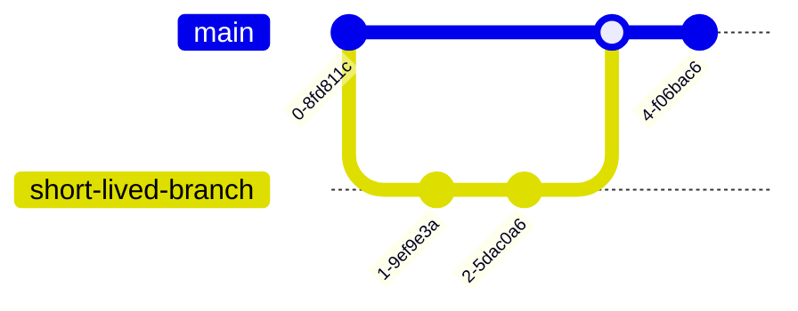
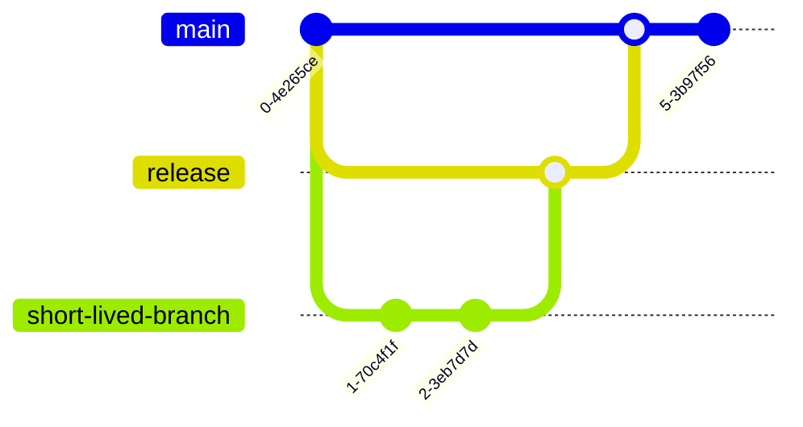

# Branching Guide

As per [_Version-Control Policies_](../version-control-policies.md), all
projects are expected to define a specific branching policy. Herein, we simply
aim to provide guidance around the more common alternatives.

Much of the focus herein is on the Git version-control system as this is the
most commonly used at The Data Shed. This guide should be updated with any
alternatives, as required.

## GitHub Flow

As the name would suggest, this branching policy comes from GitHub and their
documentation[^1] on the matter should be the point of reference.

Here, developers create branches from a main branch, then make their changes
before merging those changes back into the main branch.

This has the advantage of allowing multiple work streams to exist in parallel,
while keeping the main branch building cleanly and allowing an opportunity for
quality gates during the latter merge step.

## Git Flow

Git Flow[^2] exists as an alternative to the above.

In this branching model, a long-lived "release" branch exists in parallel to the
main branch and developers branch from this release branch.

Periodically, the release branch will be merged back into the main branch.

Should any changes (e.g. a bug-fix) be made to the main branch in the interim,
these are merged into both the main and release branches.

This has the advantage of keeping the main branch completely stable in those
circumstances where large, prologued changes need a degree of isolation.

## Footnotes

[^1]:
    [_GitHub flow_](https://docs.github.com/cn/get-started/quickstart/github-flow)

[^2]:
    [_A successful Git branching model_](https://nvie.com/posts/a-successful-git-branching-model/)

## See also

- [Git Practices](git.md)
- [Git](../git-policies.md)
